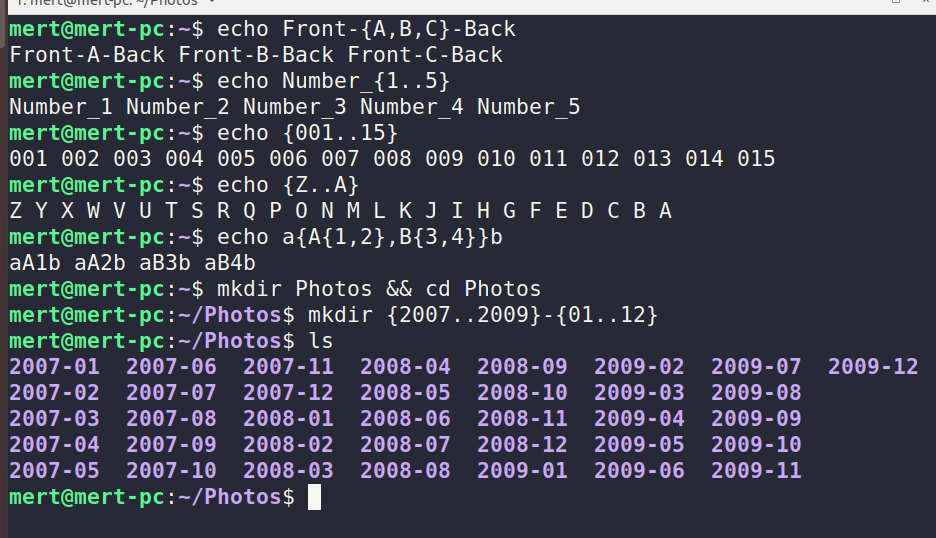

# PART 1 - LEARNING SHELL

### ``cd -`` => Change the working directory to previous working directory

### ``cd ~username`` => Change working directory to home directory of `username`

### ``ls ~ /usr`` => We can even specify multiple directories.

### ``ls -F`` => It will append a forward slash (/) if the name is a directory.


```
drwxrwxr-x
[directory] | Owner | Group | Everyone
```
```
4
File's number of hard links.
```

``file`` => shows detail of file.

For example;
``less /etc/password``

``G`` => Move to the end of the text file

``/<search text>`` => Pressing ``n`` forward the next occcurence of characters.

## You can copy text with mouse by click text doubly, then you paste with middle-click.

``cp -u *.html destination`` => Update copy when source is newer than destination.

## BE CAREFUL WITH RM.

``rm *.html`` is diffrent from ``rm * .html``

## Hard Links

It is not advisable. Space won't be allocated until all files deleted.

``ln -s item link``

`item` is either a file or a directory.

``type`` => Display a command's type.


``which`` => Display an Executable's Location.

## which cannot show buildins or aliases.

``whatis ls`` => Display One-line Manual Page Descriptions.

``info `` => Alternative to `man`.

``alias foo='cd /usr; ls; cd -'`` => (no whitespace allowed for =)

``alias`` => You can list all aliases.

## Redirection

``ls -l > ls-output.txt`` => Redirect ls outputs to ls-output.txt.

`` >> `` => append text to existing file.

``> foo.txt`` => create a new file or truncate the output file.

## Redirection


Above command redirects only std. output, not std. error. Error outputs are not redirected to ``ls-output.txt``

``ls -l /bin/x/y 2> ls-error.txt`` => Errors are redirect to ls-error.txt.

## Redirecting Standard Output and Standard Error to One File.

### ``ls -l /bin/usr > ls-all.txt 2>&1``

### Combine two redirection in recent version of bash, you can use following command

``ls -l /usr/bin &> ls-new.txt``

### Silence is golden :)

``ls -l /bin/ 2> /dev/null`` => Dispose unwanted output

Beneficial Commands
-   ``sort``
-   ``uniq`` => Omit repeated lines


Line Count | Words Count | Bytes

### grep command

`` grep pattern`` 

-   ``-i`` => ignore case sensitivity
-   ``-v`` => print only lines that do not match pattern

### head/tail command

``head -n 5 ls-output.txt`` => Show only first 5 lines

``tail -n 5 ls-output.txt`` => Show only last 5 lines

### tail command instantly
``tail -f /var/log/messages`` => Monitor logs lively

### tee command
``ls /usr/bin | tee ls.txt | grep zip``

Read from stdin and output to stdout and files.

### Arithmetic expansion


## Brace expansion

You can see all related examples following screenshot.




