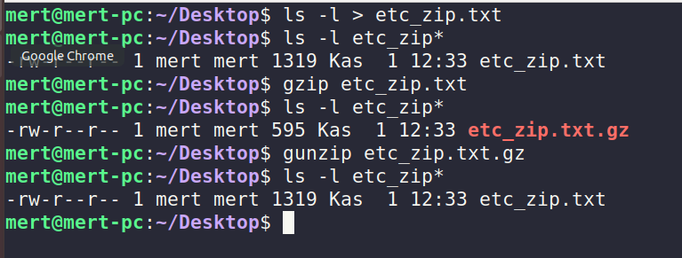

# COMMON TASK AND ESSENTIAL TOOLS

## Package Management

### Finding a Package in a Repository

``apt-cache search <package_name>``

### Listing installed packages

``dpkg -l``

## Storage Media

Working directory should be changed to apply ``unmount`` succesfully.

Output of ``/etc/fstab``

``/dev/sda2 on / type ext4 (rw,relatime,errors=remount-ro)``
=> Root file is mounted to ``/dev/sda2``

``mount -t iso9660 /dev/sdc /mnt/cdrom``

``fdisk`` can be used to manipulate partitions.

``mkfs`` can be used to create a new file system.

``fsck`` can be used to test and repair file system.

### Moving Data Directly to and from Devices

``dd if=/dev/sdb of=/dev/sdc``

Alternately, if only the first device were attached to the computer, we could copy its contents to an ordinary file for later restoration or copying.

``dd if=/dev/sdb of=flash_drive.img``

#### After inserting the CD and determining its device name (we'll assume /dev/cdrom), we can make ISO file like so

``dd if=/dev/cdrom of=ubuntu.iso``

#### For audio CDs, look at the ``cdrdao`` command.

#### To create an ISO image file containing the contents of a directory, we use the ``genisoimage`` program.

``genisoimage -o cd-rom.iso -R -J ~/cd-rom-files``

### Mounting an ISO Image Directly

``mkdir /mnt/iso_image``

``mount -t iso9660 -o loop image.iso /mnt/iso_image``

### Blanking a Rewritable CD-ROM

``wodim dev=/dev/cdrom blank=fast``

### Writing an Image

``wodim dev=/dev/cdrw image.iso``

## Networking

``netstat -ie`` => Shows interfaces.

## Searching for files

### locate - Find files the easy way
``locate bin/zip`` => It can find a file based solely on its name.

### find - The find program searches a given directory ( and its subdirectories) for files based on a variety attributes.

To find all directories.

``find ~ -type d | wc -l``

To find regular file 
``find ~ -type f -name "*.JPG" -size +1M | wc -l``

Note: -iname => Searching for case-insensitive.

``find ~ \(-type f -not -perm 600) or (-type d -not -perm 700) ``

``find ~ -type f -name '*.bak' -delete`` => Delete files ending with bak.

#### Always test the command first by substituting the -print action for -delete to confirm the search results.

### Use ``exec`` command

Note:
``'{}' ';'`` => means current pathname

### To get confirmation before action is performed.

### touch command actually updates the file.

## Archiving and backups

#### JPEG and MP3 are lossy compressions.

#### To view files of gzip

``gunzip -tv etc_zip.txt.gz``

``bzip2`` is similart to gzip but uses a different compression algorithm.

### Don't do this
``gzip picture.jpg``

Because file jpg is already compressioned, you shouldn't compress it though.

### ``command tar``

Stand for tape archive.

#### To create tar file
``tar cf playground.tar playground``

c => means create
f => means file

#### To test file tar
``tar tvf playground.tar``

#### To extract tar file

``tar xf tarfilename.tar``

#### Tar wih gzip

``tar czf playground.tgz``

#### rsync doesn't support remote-remote synchorinization. 

## Regular expressions

