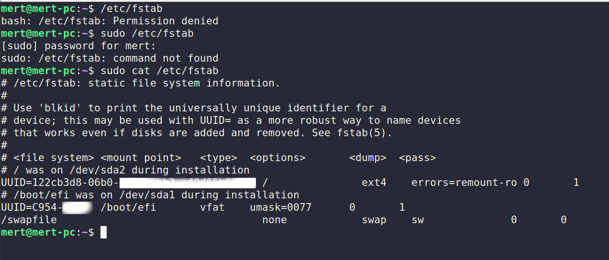
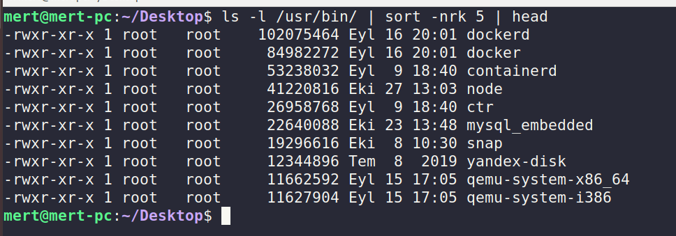
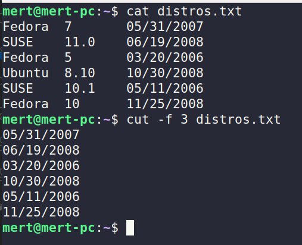
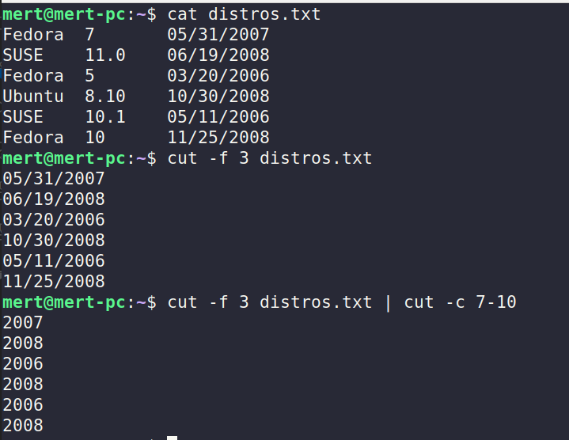
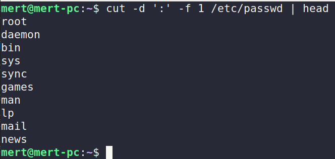
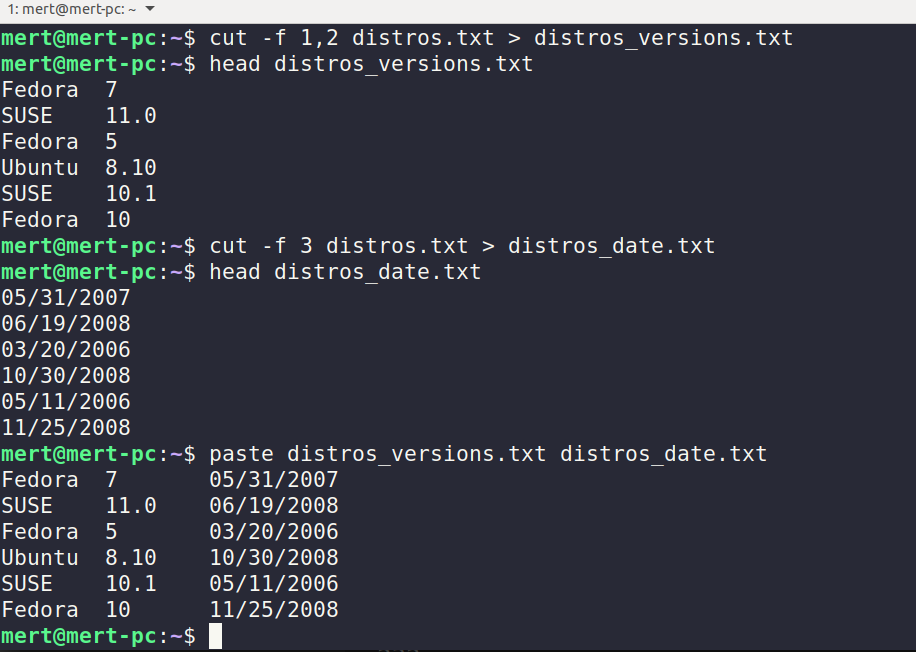
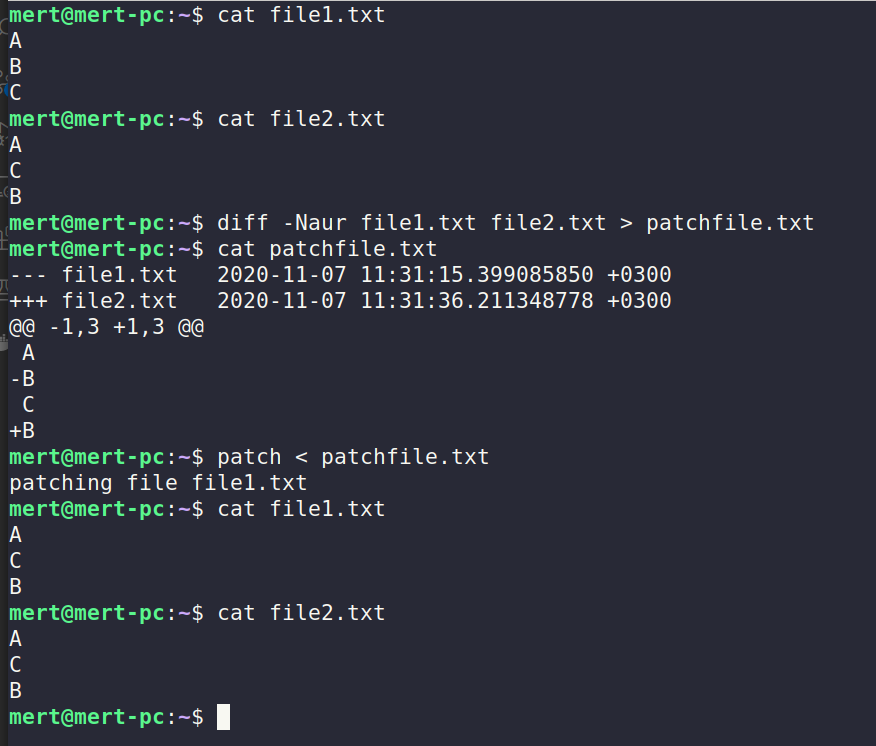
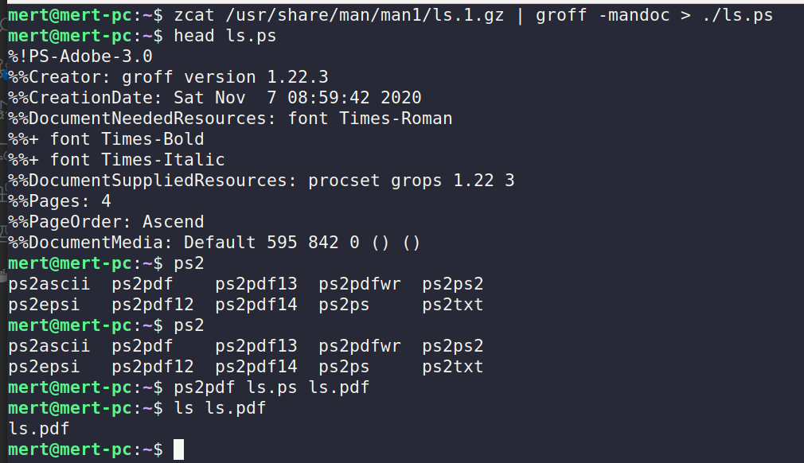

# (PART-3) COMMON TASK AND ESSENTIAL TOOLS

## Package Management

### Finding a Package in a Repository

``apt-cache search <package_name>``

### Listing installed packages

``dpkg -l``

## Storage Media

Working directory should be changed to apply ``unmount`` succesfully.

Output of ``/etc/fstab``



``/dev/sda2 on / type ext4 (rw,relatime,errors=remount-ro)``
=> Root file is mounted to ``/dev/sda2``

``mount -t iso9660 /dev/sdc /mnt/cdrom``

``fdisk`` can be used to manipulate partitions.

``mkfs`` can be used to create a new file system.

``fsck`` can be used to test and repair file system.

### Moving Data Directly to and from Devices

``dd if=/dev/sdb of=/dev/sdc``

Alternately, if only the first device were attached to the computer, we could copy its contents to an ordinary file for later restoration or copying.

``dd if=/dev/sdb of=flash_drive.img``

#### After inserting the CD and determining its device name (we'll assume /dev/cdrom), we can make ISO file like so

``dd if=/dev/cdrom of=ubuntu.iso``

#### For audio CDs, look at the ``cdrdao`` command.

#### To create an ISO image file containing the contents of a directory, we use the ``genisoimage`` program.

``genisoimage -o cd-rom.iso -R -J ~/cd-rom-files``

### Mounting an ISO Image Directly

``mkdir /mnt/iso_image``

``mount -t iso9660 -o loop image.iso /mnt/iso_image``

### Blanking a Rewritable CD-ROM

``wodim dev=/dev/cdrom blank=fast``

### Writing an Image

``wodim dev=/dev/cdrw image.iso``

## Networking

``netstat -ie`` => Shows interfaces.

## Searching for files

### locate - Find files the easy way
``locate bin/zip`` => It can find a file based solely on its name.

### find - The find program searches a given directory ( and its subdirectories) for files based on a variety attributes.

To find all directories.

``find ~ -type d | wc -l``

To find regular file 
``find ~ -type f -name "*.JPG" -size +1M | wc -l``

Note: -iname => Searching for case-insensitive.

``find ~ \(-type f -not -perm 600) or (-type d -not -perm 700) ``

``find ~ -type f -name '*.bak' -delete`` => Delete files ending with bak.

#### Always test the command first by substituting the -print action for -delete to confirm the search results.


### Use ``exec`` command


Note:
``'{}' ';'`` => means current pathname

### To get confirmation before action is performed.


### touch command actually updates the file.


## Archiving and backups

#### JPEG and MP3 are lossy compressions.


#### To view files of gzip

``gunzip -tv etc_zip.txt.gz``

``bzip2`` is similart to gzip but uses a different compression algorithm.

### Don't do this
``gzip picture.jpg``

Because file jpg is already compressioned, you shouldn't compress it though.

### ``command tar``

Stand for tape archive.

#### To create tar file
``tar cf playground.tar playground``

c => means create
f => means file

#### To test file tar
``tar tvf playground.tar``

#### To extract tar file

``tar xf tarfilename.tar``

#### Tar wih gzip

``tar czf playground.tgz``

Note: z => means gzip
Note: j => means bz2

#### rsync doesn't support remote-remote synchorinization. 

## Regular expressions

To use any character in regular expression, ``.(dot)`` is used.

^ => Find at beginning.

$ => Find at ending.

#### To use bracket expansions and character classes

``grep -h '[bg]zip' dirlist*.txt``

-h => suppress output file name

#### Negation
``grep -h '[^bg]zip' dirlist*.txt``

``grep -h '^[A-Z]' dirlist.txt``

## Text Processing

### sort command


sort -n => sort inputs numerically

sort -r => sort reversely

### sort input based on definite column

(It starts with column 1)



``sort --key=1,1 --key=2n distros.txt``

|         |       |           |
|---------|-------|-----------|
| Fedora  |5      |03/20/2006 |
| Fedora  |6      |10/24/2006 |
| Suse    |10.1   |05/11/2206 |
| Ubuntu  |6.06   |06/01/2006 |
| Ubuntu  |7.10   |10/18/2007 |
| Ubuntu  |8.10   |10/30/2008 |

``--key=1,1`` => means start at field 1 and end at field 1.

``--key=2n`` => means field 2 is sort key and that the sort should be numeric.

``sort -k 3.7nbr -k 3.1 nbr -k 3.4nbr distros.txt``

``-k 3.7nbr`` => means that use a sort key that begins at the seventh character within third field, n means numeric, b means that suppress the leading spaces. r means reverse.

#### Sort with delimiter


### Slicing and Dicing



#### Cutting character



### Cut based on delimiter



``expand`` => convert tabs to spaces

### Paste merge lines of files



### Compare Files Line By Line

There are two popular format at diff.

1. Context format ``diff -c file1.txt file2.txt``

2. Unified format ``diff -u file1.txt file2.txt``

### Prepare patch format



### Editing on the fly

#### Transliterate or Delete Characters


### ROT13 Encryption


### sed - Stream editor for filtering and transforming text


#### To specify line number

``sed '2s/front/back/`` => sed search on line 2. If number isnot specified, every line will be searched/replaced.

## Formatting Output

``nl`` equals to ``cat -n``. They show line numbers.

#### fold


You can use printf like C in bash.

#### Document Format Systems

``groff``

#### zcat
```
Normally, files compressed using gzip can be restored to their original form using gzip -d or gunzip commands. What if you want to view the contents of a compressed file without uncompressing it? For this purpose, you need the zcat command utility.
```

#### To create pdf from ps format



## Printing

### pr - Convert text files for printing

Print text files with 3 column and width 65


#### lpr => send files to default printer

#### ``lpr -P printer_name``

``-t`` => omit headers
``-3`` => 3 columns


``lpstat`` => Display print system status.

``lpq`` => Display printer queue status

``lprm/cancel`` => Cancel print jobs


