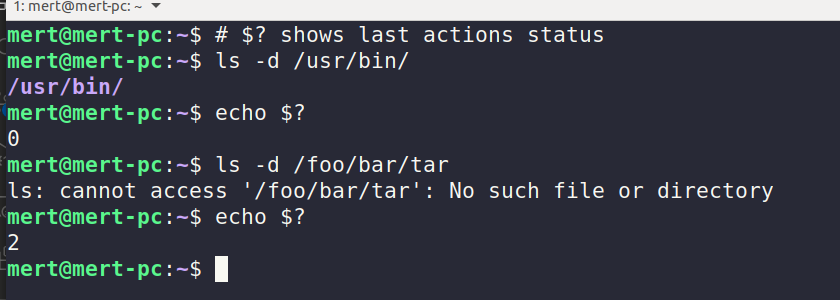
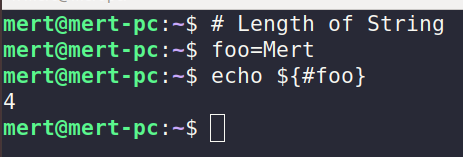
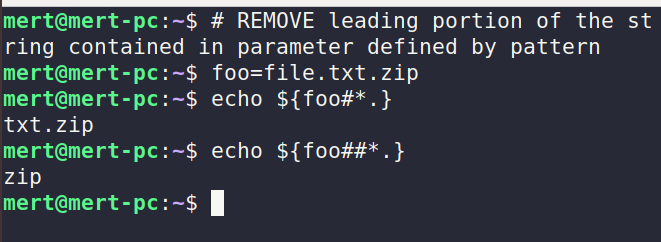
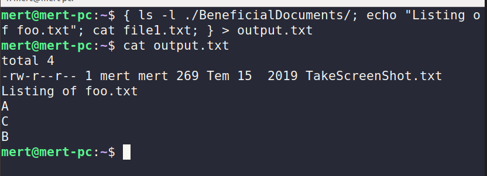
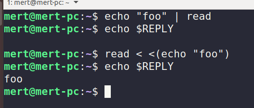
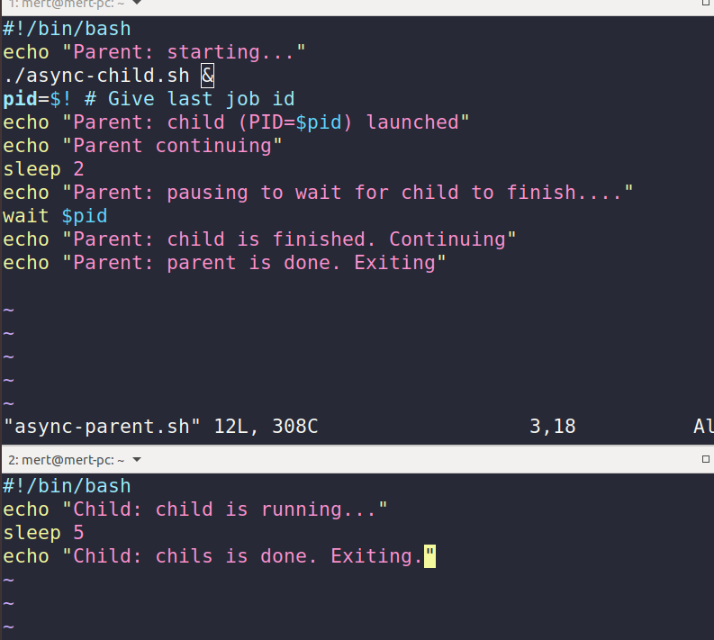

# (PART 4) Writing Shell Scripts

#### Assign value to variable & Use Variables

```
TITLE="System Information Report"

echo "
<html>
    <title>$TITLE</title>
</html>
";
```

``CURRENT_TIME="$(date)"``

### Here Documents

```
TITLE="System Information Report for $HOSTNAME"
CURRENT_TIME="$(date + "%x %r %Z)"

cat << _EOF_
<html>
    <head>
        <title>$TITLE</title>
    </head>
    <body>
        <h1>$TITLE</h1>
        <p>$TIMESTAMP</p>
    </body>
</html>

_EOF_

```

``<<- `` => ignore leading tabs

### Here Document example

```
#!/bin/bash

FTP_SERVER=ftp.nl.debian.org
FTP_PATH=/debian/dists/stretch/main/installer-amd64/current/images/cdrom
REMOTE_FILE=debian-cd_info.tar.gz

ftp -n << _EOF_

open $FTP_SERVER
user anonymous me@linuxbox
cd $FTP_PATH
hash

_EOF_


```

### if statements

#### Equality for if statements

```
if [ "$x" -eq 5 ]; then
    echo "x equals 5."
else
    echo "x does not equals 5."
fi
```

### Exit status



### Using test

-   -e  => file exists?
-   -f  => regular file?
-   -d  => directory?

```
    if [-f "$FILE"]; then
        echo "file"
    fi
```

``-z`` => length of string is zero?

``-eq`` => integer1 is equal to integer 2

```
    if [ "$INT" -eq 0]; then
        echo "zero"
    fi
```

### A More Modern Version of test

```
[[ expression ]]

string1 =~ regex

Example:

if [[ "$INT" =~ ^-?[0-9]+$ ]]; then
    echo "INT is zero"
fi
```

### ((  )) - Designed for Integers

```
    # Not use $
    if (( INT == 0 )); then

    fi

```

### Combining expressions
|Operation | test | [[ ]] and (( ))|
|----------|------|----------------|
|AND       | -a   | &&             |
|OR        | -o   | \|\|           |
|NOT       | !    | !              |

## Strings and Numbers

### IFS (Internal Field Seperator)


#### To trace bash comman, -x parameter can be used.

``#!/bin/bash -x``

`` ${foo:-"If it is not set, value will be this text."} ``


!!!!!!!!!!Sayfa 419'dan devam

### Error if empty


### Expansion That Return Variable NAmes

``${!prefix*}

### Length of String



### Extract a portion of the string

```
${parameter:offset}
${parameter:offset:length}

```




### To remove text from end of string.

```
${parameter%pattern}
${parameter%%pattern}
```

### Find and replace


## EXOTICA

#### Group Command




### Process substitiun

If pipeline exists, then subshell will be applied. Therefore, environment variables in subshell get lost after subshell processing is ended up. To solve problem, we can employ process substitution like this.




### Traps

We can use to handle received signals for script and we can ignore this signal.

To use this, we can ``traps``

### Temporary files

It is important to give temporary files nonpredictable file names. This avoids an exploit known as a ``temp race attack``


### Asynchronous Execution with wait

#### Parent

```
#!/bin/bash
echo "Parent: starting..."
./async-child.sh &
pid=$! # Give last job id
echo "Parent: child (PID=$pid) launched"
echo "Parent continuing"
sleep 2
echo "Parent: pausing to wait for child to finish...."
wait $pid
echo "Parent: child is finished. Continuing"
echo "Parent: parent is done. Exiting"
```

#### Child

```
#!/bin/bash
echo "Child: child is running..."
sleep 5
echo "Child: chils is done. Exiting."
```

### Codes



### Result


### Named Pipes


To create pipe, ``mkfifo`` is used.

After ``ls -l sth``, ``ls`` command wait to meet another process. In this example, responding process is ``cat``.

